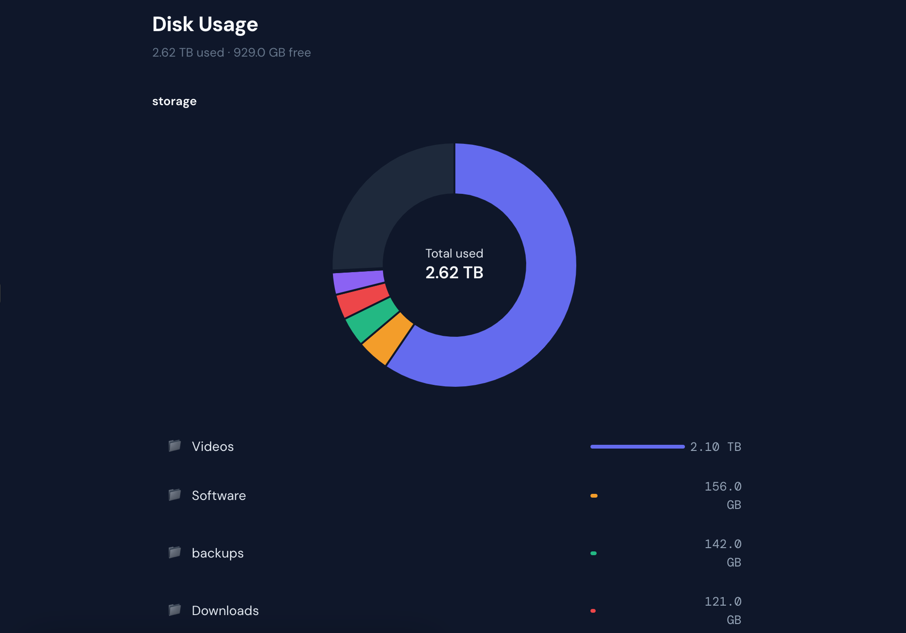

# Disk Usage Visualizer

A lightweight, self-hosted web app for visualizing disk usage with an interactive donut chart and file browser.



## Features

- **Interactive donut chart** — click to drill into folders, hover to see sizes
- **Free space visualization** — root level shows used vs free space
- **ncdu-style file list** — sorted by size with relative size bars
- **Breadcrumb navigation** — click to jump back to any parent
- **Rescan from the UI** — trigger a rescan without SSH
- **Auto-rescan** — periodic cron-based rescans in the background
- **Tiny footprint** — Python only, no dependencies, ~60MB Docker image

## Some context (AI disclosure)
Hi! It's me, a human! I wrote this small web based app to see my NAS disk usage the way I want it. After looking for different options, none of them suited what I wanted. So I built this little thing.
Unlike the rest of the project, this paragraph was written by an actual human. Everything else was created by Claude (and guided by me). But I know shit about css, python or docker. So use this at your own risk. 

## Quick Start

### Docker Compose (recommended)

```yaml
services:
  disk-usage:
    build: .
    container_name: disk-usage
    restart: unless-stopped
    ports:
      - "8888:8888"
    volumes:
      - /path/to/your/storage:/data:ro
    environment:
      - SCAN_NAME=Storage
      - SCAN_INTERVAL=6h
```

```bash
docker compose up -d
```

Open `http://localhost:8888`

### Docker Run

```bash
docker build -t disk-usage .

docker run -d \
  --name disk-usage \
  --restart unless-stopped \
  -p 8888:8888 \
  -v /path/to/your/storage:/data:ro \
  -e SCAN_NAME=Storage \
  disk-usage
```

## Configuration

| Environment Variable | Default   | Description                                              |
|---------------------|-----------|----------------------------------------------------------|
| `SCAN_PATH`         | `/data`   | Path to scan inside the container                        |
| `SCAN_NAME`         | `Storage` | Display name shown in the UI for the root folder         |
| `SCAN_INTERVAL`     | `6h`      | Time between automatic rescans (`1h`, `6h`, `12h`, `1d`) |

## API

| Endpoint         | Method | Description                          |
|-----------------|--------|--------------------------------------|
| `/api/rescan`   | POST   | Trigger a manual rescan              |
| `/api/status`   | GET    | Returns `{scanning, last_scan}`      |

## Proxmox LXC Deployment

To run on Proxmox, create a Docker LXC container and deploy:

```bash
# 1. Create a Docker LXC container
# Use a community script from https://community-scripts.org/scripts/docker
# or create one manually with Docker installed

# 2. Bind-mount your storage (read-only)
pct set <CTID> -mp0 /mnt/storage,mp=/mnt/storage,ro=1

# 3. Clone and deploy
pct exec <CTID> -- bash -c "
  apt install -y git
  cd /opt
  git clone https://github.com/Sloy/disk-usage.git
  cd disk-usage
  docker compose up -d
  echo \"Open http://\$(hostname -I | awk '{print \$1}'):8888\"
"
```

To update:

```bash
pct exec <CTID> -- bash -c "
  cd /opt/disk-usage
  git pull
  docker compose up -d --build
"
```

## Local Development

No Docker needed. Just Python 3:

```bash
cd disk-usage
python3 scan.py ~/Downloads        # scan any local folder
python3 server.py                  # serves at http://localhost:8888
```

Edit `index.html` directly, delete `www/index.html`, and restart the server to pick up changes.

## How It Works

1. `scan.py` recursively walks the mounted directory and builds a JSON tree of file/folder sizes
2. The scan result is saved as `data.json` and served by `server.py`
3. `server.py` is a zero-dependency Python HTTP server that serves the static UI and handles rescan API requests
4. Cron runs periodic rescans at the configured interval
5. The UI polls `/api/status` and auto-reloads data after a rescan completes

No database, no external dependencies, no build step.

## License

MIT
