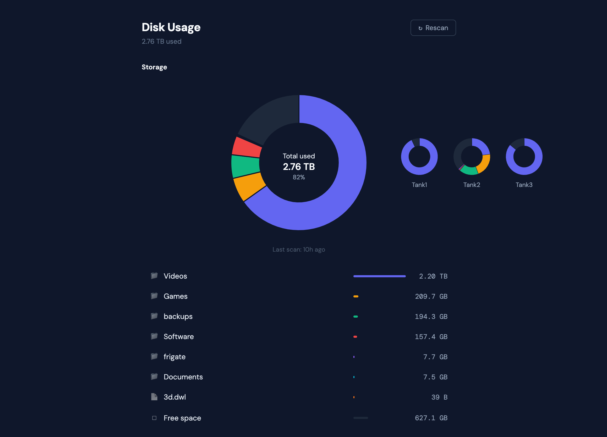

# Disk Usage Visualizer

A lightweight, self-hosted web app for visualizing disk usage with an interactive donut chart and file browser.



- [Features](#features)
- [Quick Start](#quick-start)
- [Configuration](#configuration)
- [API](#api)
- [Proxmox LXC Deployment](#proxmox-lxc-deployment)
- [Local Development](#local-development)
- [How It Works](#how-it-works)

## Features

- **Interactive donut chart** — click to drill into folders, hover to see sizes
- **Free space visualization** — root level shows used vs free space
- **ncdu-style file list** — sorted by size with relative size bars
- **Breadcrumb navigation** — click to jump back to any parent
- **Rescan from the UI** — trigger a rescan without SSH
- **Auto-rescan** — periodic daily rescans (systemd timer natively, cron in Docker)
- **Multiple disks** — monitor several root directories with a switcher
- **Fast, offline UI** — no CDN, no build step
- **Tiny footprint** — Python only, no dependencies; runs natively or in Docker

## Some context (AI disclosure)
Hi! It's me, a human! I wrote this small web based app to see my NAS disk usage the way I want it. After looking for different options, none of them suited what I wanted. So I built this little thing.
Unlike the rest of the project, this paragraph was written by an actual human. Everything else was created by Claude (and guided by me). But I know shit about css, python or docker. So use this at your own risk. 

## Quick Start

### Native (recommended for LXC)

No Docker needed. Installs as a systemd service, minimal RAM.

```bash
git clone https://github.com/rafavg/disk-usage.git
cd disk-usage
SCAN_PATH_1=/mnt/storage SCAN_NAME_1=Storage sudo bash install.sh
```

Open `http://<host-ip>:8888`

### Docker Compose

```yaml
services:
  disk-usage:
    build: .
    container_name: disk-usage
    restart: unless-stopped
    ports:
      - "8888:8888"
    volumes:
      - /mnt/storage:/data1:ro
      - /mnt/backup:/data2:ro
    environment:
      - SCAN_PATH_1=/data1
      - SCAN_NAME_1=Storage
      - SCAN_PATH_2=/data2
      - SCAN_NAME_2=Backup
      - SCAN_INTERVAL=1d
```

```bash
docker compose up -d
```

Open `http://localhost:8888`

### Docker Run

```bash
docker build -t disk-usage .

docker run -d \
  --name disk-usage \
  --restart unless-stopped \
  -p 8888:8888 \
  -v /path/to/your/storage:/data1:ro \
  -e SCAN_PATH_1=/data1 \
  -e SCAN_NAME_1=Storage \
  disk-usage
```

## Configuration

| Environment Variable | Default        | Description                                                        |
|---------------------|----------------|---------------------------------------------------------------------|
| `SCAN_PATH_n`       | —              | Path to scan for root `n` (e.g. `SCAN_PATH_1`, `SCAN_PATH_2`, …)     |
| `SCAN_NAME_n`       | basename       | Display name for root `n`                                           |
| `SCAN_PATH`         | `/data`        | Legacy single-root path; still works as root `1` if no numbered vars are set |
| `SCAN_NAME`         | `Storage`      | Legacy single-root name; still works as root `1`                    |
| `SCAN_INTERVAL`     | `1d`           | Time between automatic rescans (`30m`, `1h`, `6h`, `1d`)             |
| `PORT`              | `8888`         | HTTP port                                                            |

## API

| Endpoint                  | Method | Description                                          |
|---------------------------|--------|-------------------------------------------------------|
| `/api/roots`              | GET    | List configured roots: `[{id, name, last_scan, scanning}]` |
| `/api/status?root=<id>`   | GET    | Returns `{scanning, last_scan}` for a root (defaults to first) |
| `/api/rescan`             | POST   | Body `{"root": <id>}` — trigger a manual rescan (defaults to first) |

## Proxmox LXC Deployment

### Native LXC (lower RAM, simpler)

Use any Debian/Ubuntu LXC — no Docker required.

```bash
# 1. Create a plain Debian LXC in Proxmox (e.g., via the web UI)

# 2. Bind-mount your storage (read-only)
pct set <CTID> -mp0 /mnt/storage,mp=/mnt/storage,ro=1

# 3. Install
pct exec <CTID> -- bash -c "
  apt install -y git
  cd /opt
  git clone https://github.com/rafavg/disk-usage.git
  cd disk-usage
  SCAN_PATH_1=/mnt/storage SCAN_NAME_1=Storage bash install.sh
"
```

To update:

```bash
pct exec <CTID> -- bash -c "
  cd /opt/disk-usage
  git pull
  SCAN_PATH_1=/mnt/storage SCAN_NAME_1=Storage bash install.sh
"
```

Useful commands inside the LXC:

```bash
systemctl status disk-usage          # service status
journalctl -u disk-usage -f          # live logs
journalctl -u disk-usage-scan        # scan history
systemctl restart disk-usage         # restart
```

### Docker LXC

Use a Docker LXC (e.g., from community-scripts.org).

```bash
# 1. Bind-mount your storage (read-only)
pct set <CTID> -mp0 /mnt/storage,mp=/mnt/storage,ro=1

# 2. Clone and deploy
pct exec <CTID> -- bash -c "
  apt install -y git
  cd /opt
  git clone https://github.com/rafavg/disk-usage.git
  cd disk-usage
  docker compose up -d
  echo \"Open http://\$(hostname -I | awk '{print \$1}'):8888\"
"
```

To update:

```bash
pct exec <CTID> -- bash -c "
  cd /opt/disk-usage
  git pull
  docker compose up -d --build
"
```

## Local Development

No Docker needed. Just Python 3:

```bash
cd disk-usage
SCAN_PATH_1=~/Downloads SCAN_NAME_1=Downloads python3 server.py   # serves at http://localhost:8888
```

Edit `app.js` or `index.html` directly (no build step). Restart the server to refresh the copied assets in `www/`.

## How It Works

1. `roots.py` parses `SCAN_PATH_n`/`SCAN_NAME_n` (or legacy `SCAN_PATH`/`SCAN_NAME`) into a list of roots
2. `scan.py`/`scan_all.py` recursively walk each root and write its own `data-<id>.json`
3. `server.py` is a zero-dependency, multi-threaded Python HTTP server exposing `/api/roots`, `/api/status`, and `/api/rescan`, plus the static UI
4. On startup the server serves immediately and scans any missing root in the background — it never blocks on the initial scan
5. A daily timer (systemd natively, cron in Docker) triggers `scan_all.py` for periodic rescans
6. The frontend is a buildless React app (vendored React + `htm`, no CDN/Babel) with hash-based routing and an animated donut chart that polls `/api/status` and reloads data in place after a rescan

No database, no external dependencies, no build step.

## License

MIT
